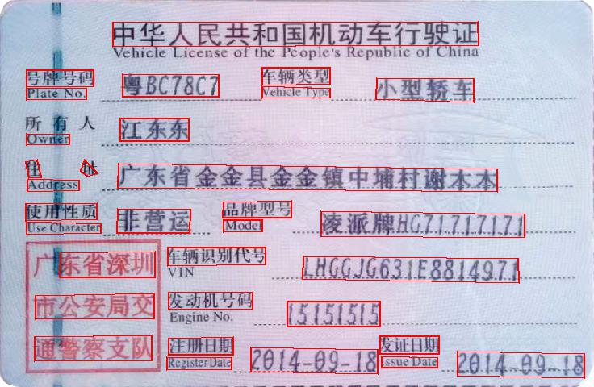

# AdvancedEAST
AdvancedEAST is an algorithm used for Scene image text detect,
which is primarily based on
[EAST:An Efficient and Accurate Scene Text Detector](https://arxiv.org/abs/1704.03155v2),
and the significant improvement was also made,
which make long text predictions more accurate.

# advantages
* writen in keras, easy to read and run
* base on EAST, an advanced text detect algorithm
* significant improvement was made, long text predictions more accurate.(please
see 'demo results' part bellow,
and pay attention to the activation image,
which starts with yellow grids, and ends with green grids.)

# setup
* python 3.6.3+
* tensorflow-gpu 1.5.0+(or tensorflow 1.5.0+)
* keras 2.1.4+
* numpy 1.14.1+
* tqdm 4.19.7+

# train
* pre-process data:
    preprocess.py,resize image
* label data:
    label.py,produce label info
* define network
    network.py
* define loss function
    losses.py
* execute training
    advanced_east.py and data_generator.py
* predict
    predict.py and nms.py

# demo results

# references
* [EAST:An Efficient and Accurate Scene Text Detector](https://arxiv.org/abs/1704.03155v2)

* [CTPN:Detecting Text in Natural Image with Connectionist Text Proposal Network](https://arxiv.org/abs/1609.03605)
